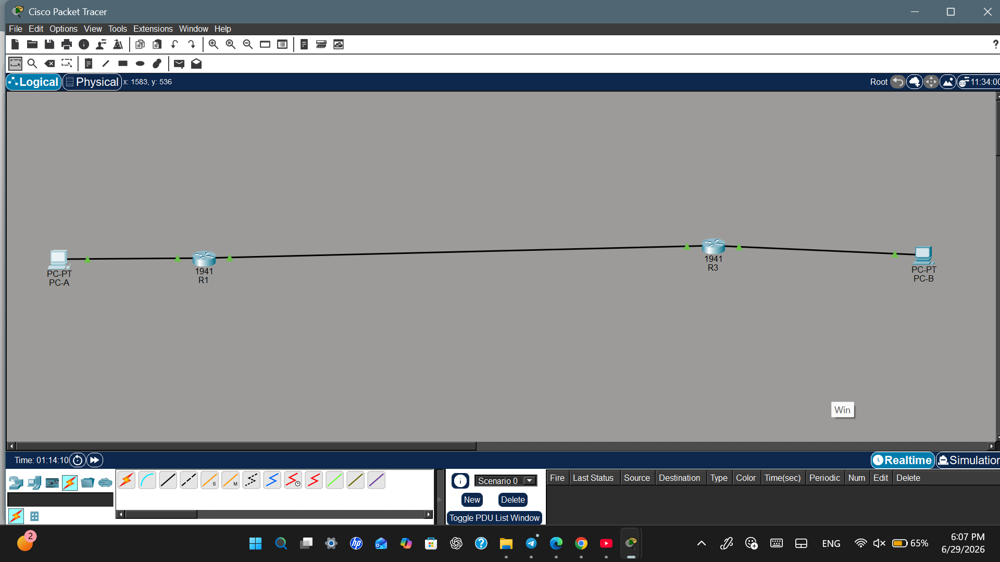
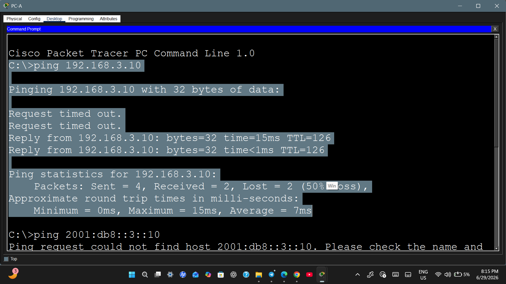
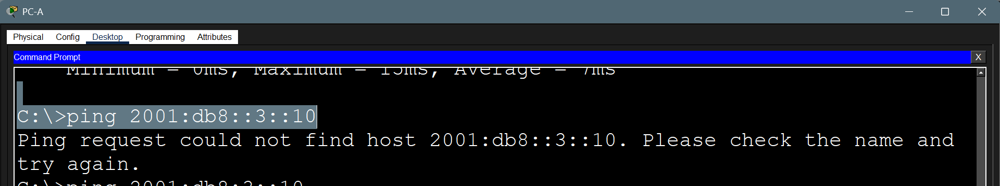
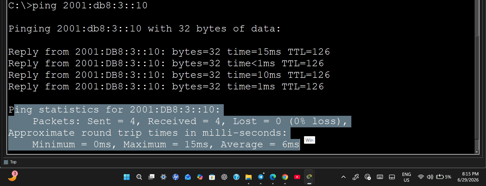

# Cisco Packet Tracer: Dual-Stack (IPv4/IPv6) Infrastructure with Static Routing

This laboratory project demonstrates the independent design, configuration, and implementation of a complete network infrastructure from scratch using **Cisco Packet Tracer**. It establishes a **Dual-Stack** environment where both IPv4 and IPv6 routing protocols run simultaneously to achieve full end-to-end connectivity.

---

## 🗺️ Network Topology
Here is the complete view of the network layout. All interfaces, gateways, and links are fully configured and showing green link lights.

---

## 🎥 Project Demonstration Video

I have recorded a short presentation video demonstrating the network layout, configuration steps, and connectivity testing.

➡️ [**Click Here to Watch the Project Video Presentation**](اضع_رابط_الفيديو_هنا) 👈

---

## 📂 Project Source File

The original Cisco Packet Tracer source file is uploaded directly to this repository. You can download and run the lab locally to verify the running configuration, routing tables, and interface layouts.

💾 [**Download the Packet Tracer File (.pkt)**](Cisco-PacketTracer-DualStack-Routing.pkt)

---

## 🛠️ Configuration Details & Technical Concepts
* **Dual-Stack Routing:** Configured the routers to process both IPv4 and IPv6 packets globally using the `ipv6 unicast-routing` command.
* **Static Routing:** Established full reachability across remote subnets using standard static routes for both IP versions:
  * IPv4 Next-Hop routing via `ip route`
  * IPv6 Next-Hop routing via `ipv6 route`

---

## 🧪 Verification & Troubleshooting (Ping Tests)

### 1. IPv4 Connectivity Success
Testing the network path from Host A to Host B using IPv4. The initial packets handled ARP resolution, followed by successful replies.

### 2. IPv6 Troubleshooting (Typo Caught)
This screenshot captures the troubleshooting process where a duplicate double-colon typo (`::3::10`) was caught, explaining the syntax constraint in IPv6 architecture.

### 3. IPv6 Connectivity Success (NDP Resolved)
The final test showing successful IPv6 end-to-end communication with **0% packet loss** using the proper compressed address layout.

---
*This project was independently developed and configured from scratch by Nuha Fallatah as an unguided lab for academic portfolio evaluation.*
